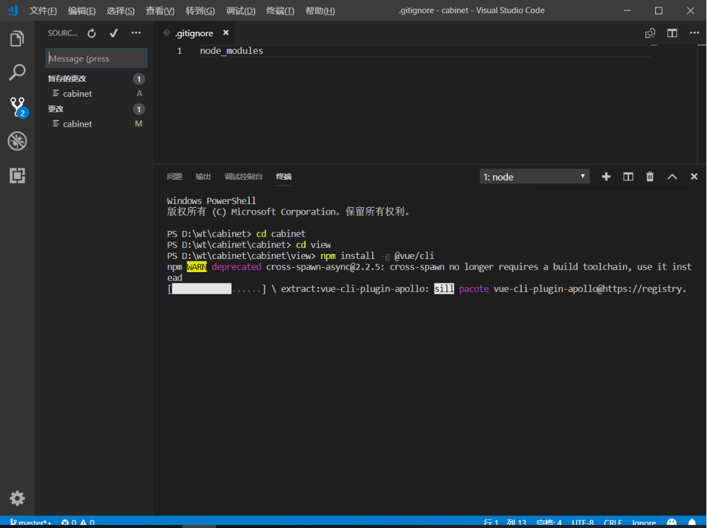
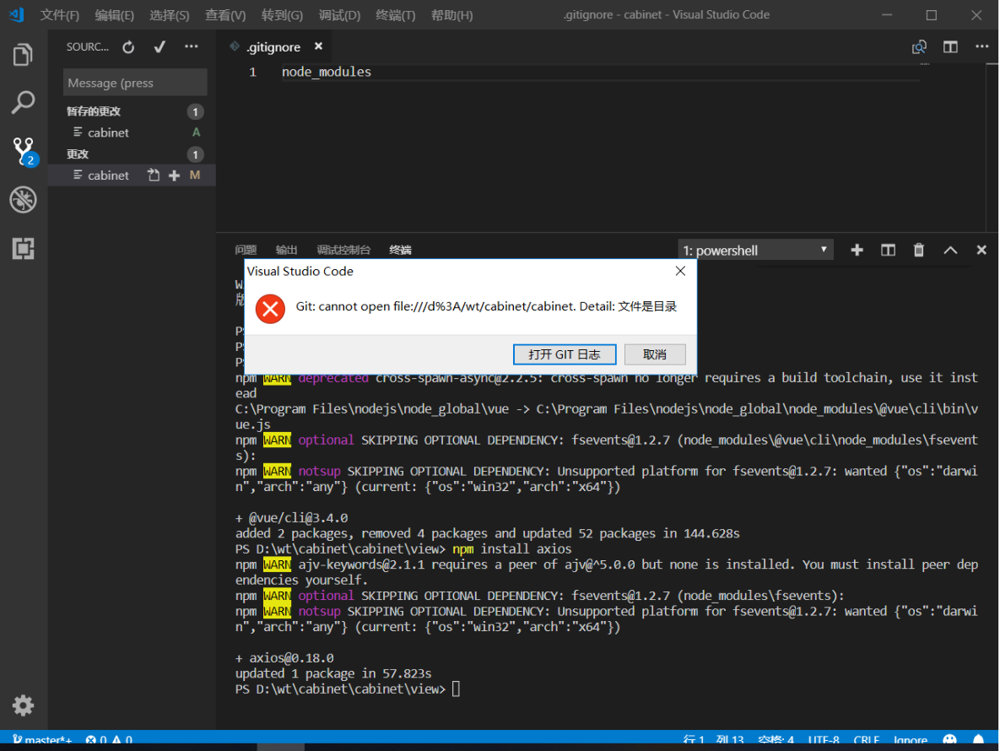
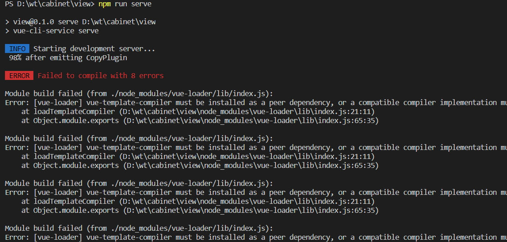
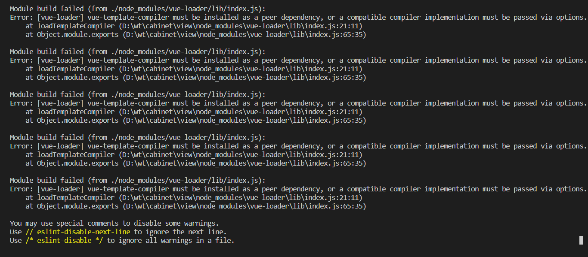
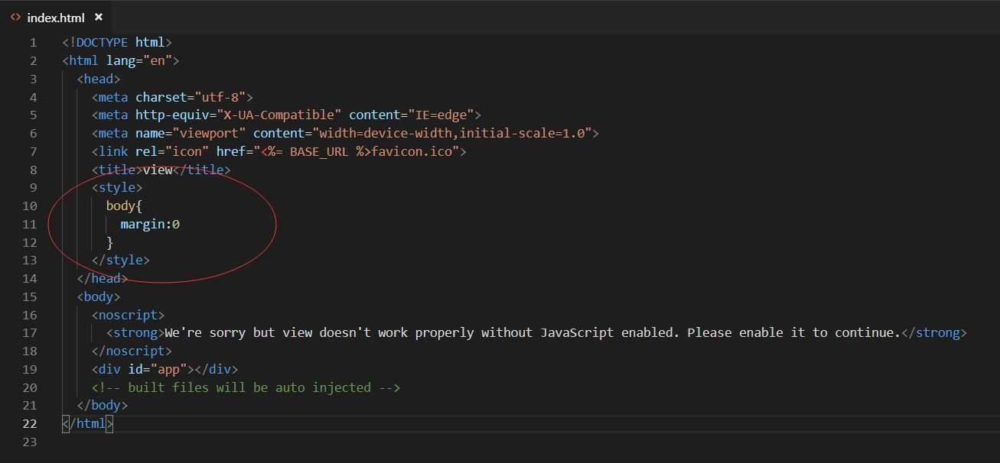

##cabinet tips
###
VUE

* 新建一个库
> git clone http://...(clone到本地文件夹)
> git init
> npm init
> npm install (依赖需安装在同级目录)
* 安装
> npm install vue
> npm install -g @vue/cli（vue脚手架）
> （注意！此处的安装应该在项目外层，node_modules与view项目在同一级目录）
> vue ui（图形化新建项目）
* 启动
> npm run serve (本地启动)
* vue官方文档（https://cn.vuejs.org/v2/guide/installation.html）——vue-cli官方文档（https://cli.vuejs.org/zh/guide/）——vue的创建者是华人，将界面语言设为“简体中文”即可获得良好阅读体验，无需谷歌翻译
* vscode无法暂存更改
>整个文件夹删掉重新建一遍
>记一次奇怪的坑：我也不知道怎么进去的，vscode就不能显示更改，也不能提示冲突了，最后的解决办法就是把最外层的文件夹删除，整个文件夹删干净，重新clone一遍（哭辽）
* 仓库添加协作者（pull/push权限）
>settings
>Collaborators
>Add collaborator
>发送邮件邀请
* 忽略依赖文件
>同级目录下建立.gitignore文件
>将想要忽略的文件名或文件夹名写入.gitignore文件
* 在github上只能删除仓库,却无法删除文件夹或文件, 所以只能通过命令来解决
>git pull origin master 将远程仓库里面的项目拉下来
>dir  查看有哪些文件夹
>git rm -r --cached Photo\ albums  删除Photo albums文件夹(这里的文件夹名有空格命令行需要用"\ "来拼接
>git commit -m '删除了Photo albums文件夹t'  提交,添加操作说明
>git push -u origin master 将本次更改更新到GitHub项目上去

* README.md——使用Ctrl+shift+v预览——“##”空格再写标题直接跟标题是无效的——“##器材柜”失败——“## 器材柜”即可
* router-link——router-link 组件支持用户在具有路由功能的应用中 (点击) 导航。 通过 to 属性指定目标地址，默认渲染成带有正确链接的 a 标签，可以通过配置 tag 属性生成别的标签.。——传送门（https://router.vuejs.org/zh/api/#router-link）——去掉下划线，a{text-decoration:none;}
* element ui—— 网页设计的模板可用
> 安装npm i element-ui -S
* vscode——多次更改却显示没有更改，无法向仓库提交代码
>git add .
>git commit -m [message]
>git push
>遇到冲突...暂时莫得办法
* 在需要移动文件夹位置时，注意先同步更新（让其他协作者先push），再进行移动操作，不然冲突会比较难搞
* 坑记录！依赖位置安装错误
> * 调整文件夹位置时，push的顺序错误，导致发生冲突无法合并
> * 于是采用将我部分的代码打包发给push了文件夹修改的同学，由她再次push的方式，确保仓库保留目前所有的代码
> * 删除我方本地文件夹，重新从仓库clone
> * 此处，发现vscode无法显示更改的问题，问题如下：
> 
>
>
>打开git日志并没有什么作用，看不懂QAQ
>* 解决的方法是，将内层的cabinet文件夹移出，删除外层的cabinet文件夹，再重新打开cabinet
>* 至此，vscode的无法显示更改问题解决，错误原因未知，但依然无法正常pull,push，此时提示错误为，没有连接仓库。
>* 于是删除cabinet文件夹，重新从仓库clone一份，开始安装依赖

>* 此时依赖位置安装错误，出现如下报错
>
>
>* 尝试安装vue-template-compiler,失败...
>* 尝试删除依赖，重新在外层安装依赖，失败...
>* 冷静分析，报错提示为vue-template-compiler的版本号与vue不匹配，估计是某次npm install时，将vue-template-compiler更新了，package.json里，把vue的版本号从2.6.2改成2.6.3与vue-template-compiler，问题解决！
 
* 背景图片设置——vue，template所有节点挂载在index.html里（一般是#app）——第一步：
第二步：
>background:url(../assets/yun.jpg);
>background-size: cover;
>min-height: 100vh;
>将这三句添加到需要的页面的style中，如添加在#app下，则所有页面统一背景
* img标签，src传参——由于vue的assets文件夹会自动webpack，导致路径改变——需将图片放到public文件夹中——public文件夹里的文件默认在根目录——路径直接写为yun.jpg即可
* 按钮点击事件页面跳转的方法
>①
>②
* ubuntu新建文件夹 mkdir name(文件夹名)
* 服务器使用root权限——有root密码（①su②输入密码）——无root密码（sudo passwd root）
* node安装脚本（在root权限下运行）
>apt remove nodejs -y
rm -rf /usr/local/bin/node /usr/local/bin/npm /usr/local/bin/npx
rm -rf /usr/local/lib/node_modules
mkdir pkg
wget https://nodejs.org/dist/v8.11.3/node-v8.11.3-linux-x64.tar.xz -P ./pkg -O ./pkg/node.tar.xz
xz -d ./pkg/node.tar.xz
mkdir /home/nodejs
tar -xvf ./pkg/node.tar -C /home/nodejs/
rm -rf pkg
mv /home/nodejs/node-v8.11.3-linux-x64 /home/nodejs/bin/
ln -s /home/nodejs/bin/bin/node /usr/local/bin/node
ln -s /home/nodejs/bin/bin/npm /usr/local/bin/npm
ln -s /home/nodejs/bin/bin/npx /usr/local/bin/npx
node -v
* vue的打包部署
>①安装node、express
>②express-template包（此处克隆了姜m的https://github.com/lancelotnemoj/express-template）
>③（将vue页面打包）npm run build
>④在/home/ubuntu/express-template中，新建public文件夹（mkdir publick）
>⑤将生成的dist文件夹中的所有文件放到服务器/home/ubuntu/express-template/public
>⑥更改config.js中的端口号，在命令行执行node index.js(可能会报错没有morgan),npm install morgan就好了
>⑦访问xxx.xxx.xxx.xxx(服务器地址):xxxx（端口号）/index.html
* forever安装
>npm install forever
>建立软连接(sudo ln -s /home/nodejs/bin/bin/forever(一个空格)/usr/local/bin/forever)
>(以上由于安装node的脚本存在一些问题，所以需要这样)
###
axios

* 安装
> npm install axios
> npm install vuex --save

* 我觉得这个教程还蛮清楚的https://www.kancloud.cn/yunye/axios/234845
*  解决跨域问题
> 在服务端app.js中加入
> 
###
数据库

* 遇到如下报错
> npm ERR! Unexpected token < in JSON at position 115
解决办法是查看package-lock.json,修改报错

* 安装
> npm install express 
> npm install mysql
> npm install ejs

* 启动
> cd 到app.js所在的文件夹，运行npm start
###
Tips

* 关于安装
> 在首次安装时执行-s,之后重新安装依赖秩序npm install 即可
> 例如：npm install vue -s

