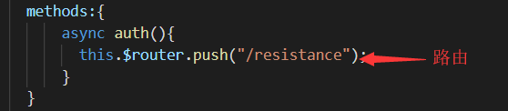

## 器材柜笔记
* 新建一个库——git clone到本地文件夹——git init——npm init——npm install (依赖需安装在同级目录)
* vue的安装——npm install vue——npm install -g @vue/cli（vue脚手架）——vue ui（图形化新建项目）
* vue官方文档（https://cn.vuejs.org/v2/guide/installation.html）——vue-cli官方文档（https://cli.vuejs.org/zh/guide/）——vue的创建者是华人，将界面语言设为“简体中文”即可获得良好阅读体验，无需谷歌翻译
* vscode无法暂存更改——整个文件夹删掉重新建一遍
* 仓库添加协作者（pull/push权限）——settings——Collaborators——Add collaborator
* 忽略依赖文件——同级目录下建立.gitignore文件——将想要忽略的文件名或文件夹名写入.gitignore文件
* 在github上只能删除仓库,却无法删除文件夹或文件, 所以只能通过命令来解决

>$ git pull origin master 将远程仓库里面的项目拉下来

>$ dir  查看有哪些文件夹

>$ git rm -r --cached Photo\ albums  删除Photo albums文件夹(这里的文件夹名有空格命令行需要用"\ "来拼接

>$ git commit -m '删除了Photo albums文件夹t'  提交,添加操作说明

>$ git push -u origin master 将本次更改更新到GitHub项目上去

* README.md——使用Ctrl+shift+v预览——“##”空格再写标题直接跟标题是无效的——“##器材柜”失败——“## 器材柜”即可
* router-link——router-link 组件支持用户在具有路由功能的应用中 (点击) 导航。 通过 to 属性指定目标地址，默认渲染成带有正确链接的 a 标签，可以通过配置 tag 属性生成别的标签.。——传送门（https://router.vuejs.org/zh/api/#router-link）——去掉下划线，a{text-decoration:none;}
* element ui—— 网页设计的模板可用
* vscode——多次更改却显示没有更改，无法向仓库提交代码——git add .——git commit -m [message]——git push
* 背景图片设置——vue，template所有节点挂载在index.html里（一般是#app）——第一步：
第二步：background:url(../assets/yun.jpg);background-size: cover;min-height: 100vh;将这三句添加到需要的页面的style中，如添加在#app下，则所有页面统一背景
* img标签，src传参——由于vue的assets文件夹会自动webpack，导致路径改变——需将图片放到public文件夹中——public文件夹里的文件默认在根目录——路径直接写为yun.jpg即可
* 按钮点击事件页面跳转的方法——①
——②
* ubuntu新建文件夹 mkdir name(文件夹名)
* 服务器使用root权限——有root密码（①su②输入密码）——无root密码（sudo passwd root）
* node安装脚本（在root权限下运行）
>apt remove nodejs -y
rm -rf /usr/local/bin/node /usr/local/bin/npm /usr/local/bin/npx
rm -rf /usr/local/lib/node_modules
mkdir pkg
wget https://nodejs.org/dist/v8.11.3/node-v8.11.3-linux-x64.tar.xz -P ./pkg -O ./pkg/node.tar.xz
xz -d ./pkg/node.tar.xz
mkdir /home/nodejs
tar -xvf ./pkg/node.tar -C /home/nodejs/
rm -rf pkg
mv /home/nodejs/node-v8.11.3-linux-x64 /home/nodejs/bin/
ln -s /home/nodejs/bin/bin/node /usr/local/bin/node
ln -s /home/nodejs/bin/bin/npm /usr/local/bin/npm
ln -s /home/nodejs/bin/bin/npx /usr/local/bin/npx
node -v
* vue的打包部署——①安装node、express——②express-template包（此处克隆了姜m的https://github.com/lancelotnemoj/express-template）——③讲vue页面打包，vscode执行npm run build——④在/home/ubuntu/express-template中，新建public文件夹（mkdir publick）——⑤将生成的dist文件夹中的所有文件放到服务器/home/ubuntu/express-template/public——⑥更改config.js中的端口号，在命令行执行node index.js(可能会报错没有morgan),npm install morgan就好了——⑦访问xxx.xxx.xxx.xxx(服务器地址):xxxx（端口号）/index.html

